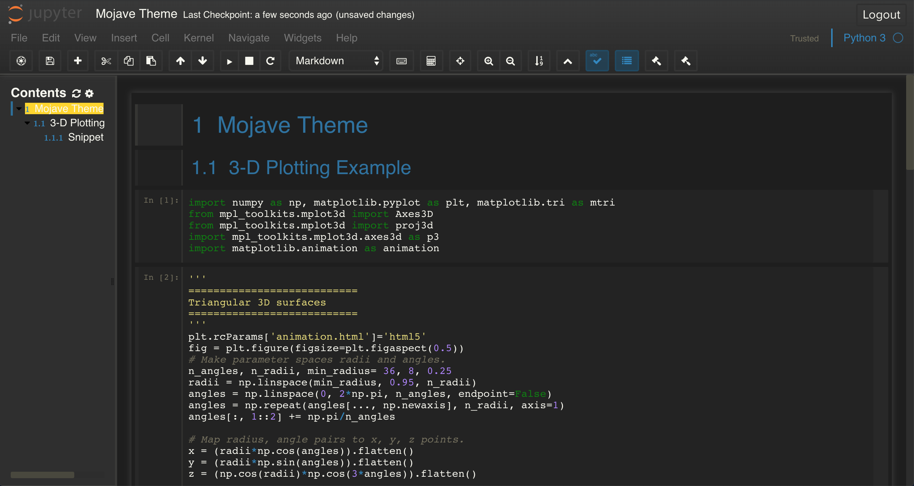
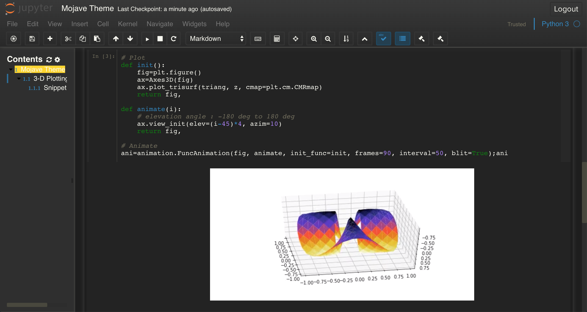
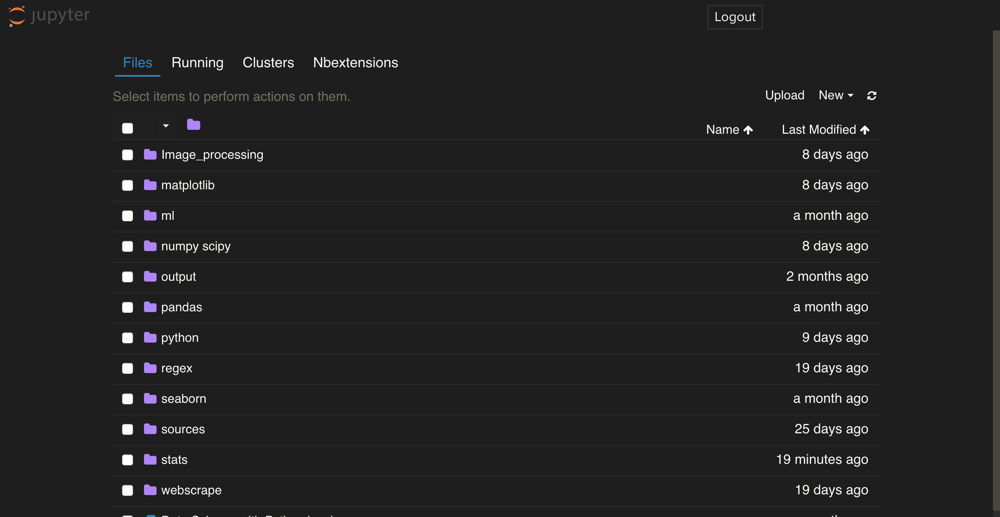
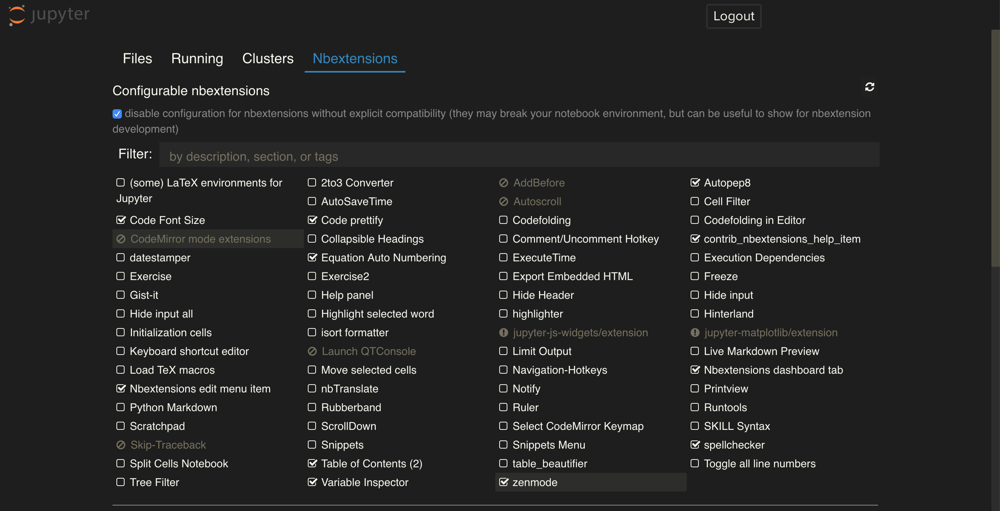

## Jupyter-Mojave-theme

### Sophisticated Dark theme for Jupyter Notebook

  

  

  

  

### How to apply this theme

1. Make 'cumtom folder under .jupyter folder'
2. Add this 'mojave.css' in the folder
3. Change the file name 'mojave.css' to 'custom.css'
4. Refresh local browser or restart Jupyter Notebook

### Contact me

Feel free to request me, throw me issues, or folk.
My address: ryotala0528@gmail.com

This theme is based on [the Monokai theme of jupyter themes repository](https://github.com/dunovank/jupyter-themes/tree/master/jupyterthemes/styles/compiled). Please find original source from the preceeding link.

